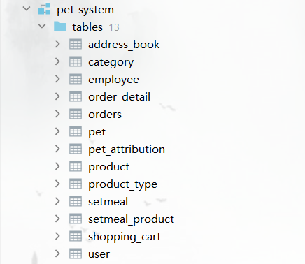
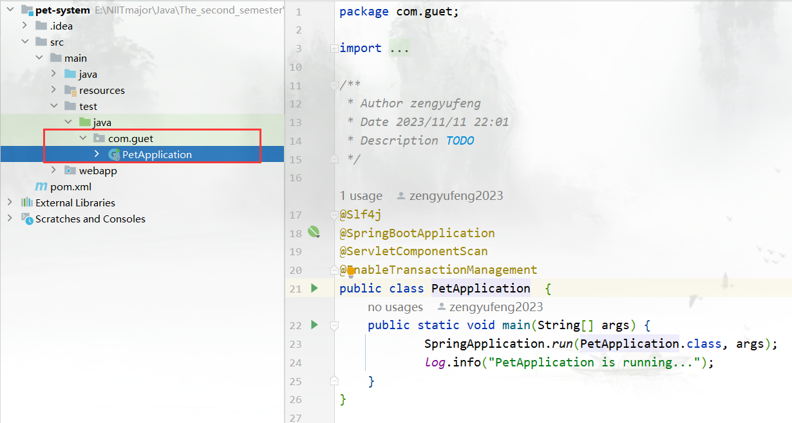

# 21Java1-group15 :stuck_out_tongue_winking_eye:  :stuck_out_tongue: 

### 一、简介 :relaxed:  :blush: 
曾玉凤，黄钇嘉协作完成的宠物宠物商城项目。

#### 1.1 功能描述

​		**管理端**：主要包含用户管理，分类管理，商品管理，套餐管理和订单管理。用户管理分为管理员、普通员工、c端用户。

- 管理员：可以禁用或启用用户；
- 分类管理：主要对商品进行分类，主要与宠物管理以及宠物产品管理关联；
- 套餐管理：主要与商品关联，将几个商品组合成一个套餐；
- 宠物管理：宠物产品管理包含有与此对应的类型表；
- 订单管理：负责对用户端的订单进行管理。

​		**用户端**：用户可以在宠物商城挑选合适的宠物及其产品进行下单，有首页和个人主页。

- 首页：对某个商品或套餐先加入购物车选择数量，然后进行下单。
- 个人主页：可以看到历史订单、添加收货地址

#### 1.2 角色

1. **后台系统管理员**:登录后台管理系统，拥有后台系统中的所有操作权限后台系统。
2. **普通员工**:登录后台管理系统，对宠物、宠物产品、套餐、订单等进行管理。
3. **C端用户**:登录移动端应用，可以浏览商品、添加购物车、设置地址、在线下单等。

### 二、语言及框架

1. Maven
2. JavaWeb(使用已写好的前端代码)
   - HTML+CSS+JavaScript+Vue
3. MySQL
4. Spring Boot
5. SSM(Spring、Spring MVC、MyBatis Plus)
6. JavaEE（基础知识）

### 三、安装环境

> 环境

1. jdk 1.8

2. mysql 8.0.xx

3. maven 3.8.xx

> 软件

1. IntelliJ IDEA 2022.3.3

2. MySQL Workbench 8.0 CE

### 四、项目说明

1. 创建数据库。

   

2. 找到项目`PetApplication.java` 这个文件启动整个项目。

   

3.  启动成功，进行登录，只有管理员和普通员工可以登录管理端。普通用户可以登录用户端购买商品

### 五、参与贡献

曾玉凤、黄钇嘉

### 六、致谢
# 21-java1-group15
